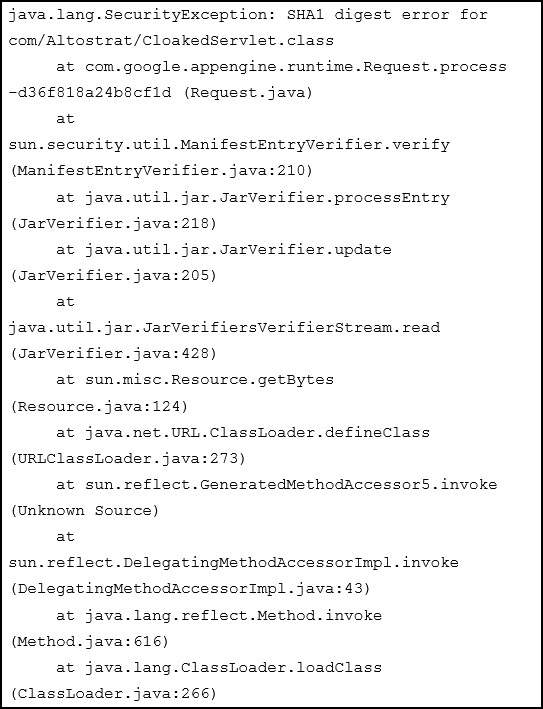

You deploy your custom Java application to Google App Engine. It fails to deploy and gives you the following stack trace.
What should you do?

    A. Upload missing JAR files and redeploy your application.

    B. Digitally sign all of your JAR files and redeploy your application

    C. Recompile the CLoakedServlet class using and MD5 hash instead of SHA1

---
You are designing a mobile chat application. You want to ensure people cannot spoof chat messages, by providing a message were sent by a specific user.
What should you do?

    A. Tag messages client side with the originating user identifier and the destination user.

    B. Encrypt the message client side using block-based encryption with a shared key.

    C. Use public key infrastructure (PKI) to encrypt the message client side using the originating user's private key.

    D. Use a trusted certificate authority to enable SSL connectivity between the client application and the server.
---

As part of implementing their disaster recovery plan, your company is trying to replicate their production MySQL database from their private data center to their
GCP project using a Google Cloud VPN connection. They are experiencing latency issues and a small amount of packet loss that is disrupting the replication.
What should they do?

    A. Configure their replication to use UDP.

    B. Configure a Google Cloud Dedicated Interconnect.

    C. Restore their database daily using Google Cloud SQL.

    D. Add additional VPN connections and load balance them.

    E. Send the replicated transaction to Google Cloud Pub/Sub.

---

Your customer support tool logs all email and chat conversations to Cloud Bigtable for retention and analysis. What is the recommended approach for sanitizing this data of personally identifiable information or payment card information before initial storage?

    A. Hash all data using SHA256

    B. Encrypt all data using elliptic curve cryptography

    C. De-identify the data with the Cloud Data Loss Prevention API

    D. Use regular expressions to find and redact phone numbers, email addresses, and credit card numbers

---

You are using Cloud Shell and need to install a custom utility for use in a few weeks. Where can you store the file so it is in the default execution path and persists across sessions?

    A. ~/bin

    B. Cloud Storage

    C. /google/scripts

    D. /usr/local/bin

---
B,C,B,C,A
