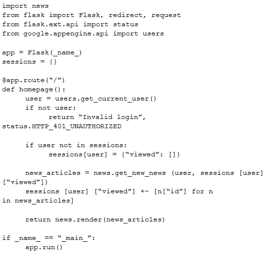

The operations manager asks you for a list of recommended practices that she should consider when migrating a J2EE application to the cloud.
Which three practices should you recommend? Choose 3 answers.

    A. Port the application code to run on Google App Engine

    B. Integrate Cloud Dataflow into the application to capture real-time metrics

    C. Instrument the application with a monitoring tool like Stackdriver Debugger

    D. Select an automation framework to reliably provision the cloud infrastructure

    E. Deploy a continuous integration tool with automated testing in a staging environment

    F. Migrate from MySQL to a managed NoSQL database like Google Cloud Datastore or Bigtable
---
A news feed web service has the following code running on Google App Engine. During peak load, users report that they can see news articles they already viewed.
What is the most likely cause of this problem?

    A. The session variable is local to just a single instance

    B. The session variable is being overwritten in Cloud Datastore

    C. The URL of the API needs to be modified to prevent caching

    D. The HTTP Expires header needs to be set to -1 stop caching

---

An application development team believes their current logging tool will not meet their needs for their new cloud-based product. They want a better tool to capture errors and help them analyze their historical log data. You want to help them find a solution that meets their needs.
What should you do?

    A. Direct them to download and install the Google StackDriver logging agent

    B. Send them a list of online resources about logging best practices

    C. Help them define their requirements and assess viable logging tools

    D. Help them upgrade their current tool to take advantage of any new features
---

You need to reduce the number of unplanned rollbacks of erroneous production deployments in your company's web hosting platform. Improvement to the QA/
Test processes accomplished an 80% reduction.
Which additional two approaches can you take to further reduce the rollbacks? Choose 2 answers.

    A. Introduce a green-blue deployment model

    B. Replace the QA environment with canary releases

    C. Fragment the monolithic platform into microservices

    D. Reduce the platform's dependency on relational database systems

    E. Replace the platform's relational database systems with a NoSQL database

---

To reduce costs, the Director of Engineering has required all developers to move their development infrastructure resources from on-premises virtual machines
(VMs) to Google Cloud Platform. These resources go through multiple start/stop events during the day and require state to persist. You have been asked to design the process of running a development environment in Google Cloud while providing cost visibility to the finance department.
Which two steps should you take? Choose 2 answers.

    A. Use the - -no-auto-delete flag on all persistent disks and stop the VM

    B. Use the - -auto-delete flag on all persistent disks and terminate the VM

    C. Apply VM CPU utilization label and include it in the BigQuery billing export

    D. Use Google BigQuery billing export and labels to associate cost to groups

    E. Store all state into local SSD, snapshot the persistent disks, and terminate the VM

    F. Store all state in Google Cloud Storage, snapshot the persistent disks, and terminate the VM

---
(A D E),A,C,(A C),(A D)
