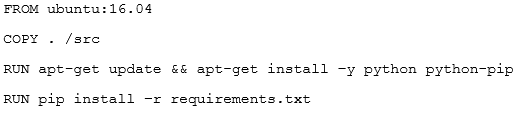

Your company is forecasting a sharp increase in the number and size of Apache Spark and Hadoop jobs being run on your local datacenter. You want to utilize the cloud to help you scale this upcoming demand with the least amount of operations work and code change.
Which product should you use?

    A. Google Cloud Dataflow
    B. Google Cloud Dataproc
    C. Google Compute Engine
    D. Google Kubernetes Engine

---

The database administration team has asked you to help them improve the performance of their new database server running on Google Compute Engine. The database is for importing and normalizing their performance statistics and is built with MySQL running on Debian Linux. They have an n1-standard-8 virtual machine with 80 GB of SSD persistent disk.
What should they change to get better performance from this system?

    A. Increase the virtual machine's memory to 64 GB
    B. Create a new virtual machine running PostgreSQL
    C. Dynamically resize the SSD persistent disk to 500 GB
    D. Migrate their performance metrics warehouse to BigQuery
    E. Modify all of their batch jobs to use bulk inserts into the database

----

You want to optimize the performance of an accurate, real-time, weather-charting application. The data comes from 50,000 sensors sending 10 readings a second, in the format of a timestamp and sensor reading.
Where should you store the data?

    A. Google BigQuery
    B. Google Cloud SQL
    C. Google Cloud Bigtable
    D. Google Cloud Storage

---

Your company's user-feedback portal comprises a standard LAMP stack replicated across two zones. It is deployed in the us-central1 region and uses autoscaled managed instance groups on all layers, except the database. Currently, only a small group of select customers have access to the portal. The portal meets a
99,99% availability SLA under these conditions. However next quarter, your company will be making the portal available to all users, including unauthenticated users. You need to develop a resiliency testing strategy to ensure the system maintains the SLA once they introduce additional user load.
What should you do?

    A. Capture existing users input, and replay captured user load until autoscale is triggered on all layers. At the same time, terminate all resources in one of the zones

    B. Create synthetic random user input, replay synthetic load until autoscale logic is triggered on at least one layer, and introduce "chaos" to the system by terminating random resources on both zones

    C. Expose the new system to a larger group of users, and increase group size each day until autoscale logic is triggered on all layers. At the same time, terminate random resources on both zones

    D. Capture existing users input, and replay captured user load until resource utilization crosses 80%. Also, derive estimated number of users based on existing user's usage of the app, and deploy enough resources to handle 200% of expected load

---

One of the developers on your team deployed their application in Google Container Engine with the Dockerfile below. They report that their application deployments are taking too long.

You want to optimize this Dockerfile for faster deployment times without adversely affecting the app's functionality.
Which two actions should you take? Choose 2 answers.

    A. Remove Python after running pip
    B. Remove dependencies from requirements.txt
    C. Use a slimmed-down base image like Alpine Linux
    D. Use larger machine types for your Google Container Engine node pools
    E. Copy the source after he package dependencies (Python and pip) are installed

---
B,C,C,B,(C E)