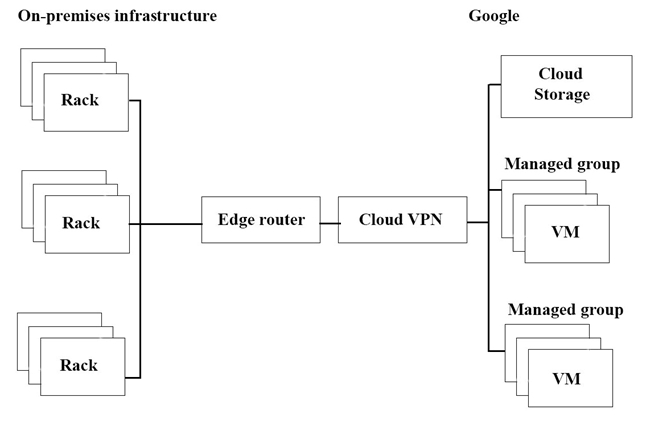

Introductory Info

**Company Overview -**
JencoMart is a global retailer with over 10,000 stores in 16 countries. The stores carry a range of goods, such as groceries, tires, and jewelry. One of the company's core values is excellent customer service. In addition, they recently introduced an environmental policy to reduce their carbon output by 50% over the next 5 years.

**Company Background -**
JencoMart started as a general store in 1931, and has grown into one of the world's leading brands, known for great value and customer service. Over time, the company transitioned from only physical stores to a stores and online hybrid model, with 25% of sales online. Currently, JencoMart has little presence in Asia, but considers that market key for future growth.

**Solution Concept -**
JencoMart wants to migrate several critical applications to the cloud but has not completed a technical review to determine their suitability for the cloud and the engineering required for migration. They currently host all of these applications on infrastructure that is at its end of life and is no longer supported.

**Existing Technical Environment -**
JencoMart hosts all of its applications in 4 data centers: 3 in North American and 1 in Europe; most applications are dual-homed.
JencoMart understands the dependencies and resource usage metrics of their on-premises architecture.
Application: Customer loyalty portal
LAMP (Linux, Apache, MySQL and PHP) application served from the two JencoMart-owned U.S. data centers.

**Database -**
Oracle Database stores user profiles
- 20 TB
- Complex table structure
- Well maintained, clean data
- Strong backup strategy
PostgreSQL database stores user credentials
- Single-homed in US West
- No redundancy
- Backed up every 12 hours
- 100% uptime service level agreement (SLA)
- Authenticates all users

**Compute -**
30 machines in US West Coast, each machine has:
- Twin, dual core CPUs
- 32 GB of RAM
- Twin 250 GB HDD (RAID 1)
20 machines in US East Coast, each machine has:
- Single, dual-core CPU
- 24 GB of RAM
- Twin 250 GB HDD (RAID 1)

**Storage -**
Access to shared 100 TB SAN in each location
Tape backup every week

**Business Requirements -**
Optimize for capacity during peak periods and value during off-peak periods
Guarantee service availability and support
Reduce on-premises footprint and associated financial and environmental impact
Move to outsourcing model to avoid large upfront costs associated with infrastructure purchase
Expand services into Asia

**Technical Requirements -**
Assess key application for cloud suitability
Modify applications for the cloud
Move applications to a new infrastructure
Leverage managed services wherever feasible
Sunset 20% of capacity in existing data centers
Decrease latency in Asia

**CEO Statement -**
JencoMart will continue to develop personal relationships with our customers as more people access the web. The future of our retail business is in the global market and the connection between online and in-store experiences. As a large, global company, we also have a responsibility to the environment through "green" initiatives and policies.

**CTO Statement -**
The challenges of operating data centers prevent focus on key technologies critical to our long-term success. Migrating our data services to a public cloud infrastructure will allow us to focus on big data and machine learning to improve our service to customers.

**CFO Statement -**
Since its founding, JencoMart has invested heavily in our data services infrastructure. However, because of changing market trends, we need to outsource our infrastructure to ensure our long-term success. This model will allow us to respond to increasing customer demand during peak periods and reduce costs.
Question
The JencoMart security team requires that all Google Cloud Platform infrastructure is deployed using a least privilege model with separation of duties for administration between production and development resources.
What Google domain and project structure should you recommend?

    A. Create two G Suite accounts to manage users: one for development/test/staging and one for production. Each account should contain one project for every application

    B. Create two G Suite accounts to manage users: one with a single project for all development applications and one with a single project for all production applications

    C. Create a single G Suite account to manage users with each stage of each application in its own project

    D. Create a single G Suite account to manage users with one project for the development/test/staging environment and one project for the production environment

-----

Introductory Info

**Company Overview -**

JencoMart is a global retailer with over 10,000 stores in 16 countries. The stores carry a range of goods, such as groceries, tires, and jewelry. One of the company's core values is excellent customer service. In addition, they recently introduced an environmental policy to reduce their carbon output by 50% over the next 5 years.

**Company Background -**

JencoMart started as a general store in 1931, and has grown into one of the world's leading brands, known for great value and customer service. Over time, the company transitioned from only physical stores to a stores and online hybrid model, with 25% of sales online. Currently, JencoMart has little presence in Asia, but considers that market key for future growth.

**Solution Concept -**

JencoMart wants to migrate several critical applications to the cloud but has not completed a technical review to determine their suitability for the cloud and the engineering required for migration. They currently host all of these applications on infrastructure that is at its end of life and is no longer supported.

**Existing Technical Environment -**

JencoMart hosts all of its applications in 4 data centers: 3 in North American and 1 in Europe; most applications are dual-homed.
JencoMart understands the dependencies and resource usage metrics of their on-premises architecture.
Application: Customer loyalty portal
LAMP (Linux, Apache, MySQL and PHP) application served from the two JencoMart-owned U.S. data centers.

**Database -**

Oracle Database stores user profiles
- 20 TB
- Complex table structure
- Well maintained, clean data
- Strong backup strategy
PostgreSQL database stores user credentials
- Single-homed in US West
- No redundancy
- Backed up every 12 hours
- 100% uptime service level agreement (SLA)
- Authenticates all users

**Compute -**
30 machines in US West Coast, each machine has:
- Twin, dual core CPUs
- 32 GB of RAM
- Twin 250 GB HDD (RAID 1)
20 machines in US East Coast, each machine has:
- Single, dual-core CPU
- 24 GB of RAM
- Twin 250 GB HDD (RAID 1)

**Storage -**

Access to shared 100 TB SAN in each location
Tape backup every week

**Business Requirements -**

Optimize for capacity during peak periods and value during off-peak periods
Guarantee service availability and support
Reduce on-premises footprint and associated financial and environmental impact
Move to outsourcing model to avoid large upfront costs associated with infrastructure purchase
Expand services into Asia

**Technical Requirements -**

Assess key application for cloud suitability
Modify applications for the cloud
Move applications to a new infrastructure
Leverage managed services wherever feasible
Sunset 20% of capacity in existing data centers
Decrease latency in Asia

**CEO Statement -**

JencoMart will continue to develop personal relationships with our customers as more people access the web. The future of our retail business is in the global market and the connection between online and in-store experiences. As a large, global company, we also have a responsibility to the environment through "green" initiatives and policies.

**CTO Statement -**

The challenges of operating data centers prevent focus on key technologies critical to our long-term success. Migrating our data services to a public cloud infrastructure will allow us to focus on big data and machine learning to improve our service to customers.

**CFO Statement -**

Since its founding, JencoMart has invested heavily in our data services infrastructure. However, because of changing market trends, we need to outsource our infrastructure to ensure our long-term success. This model will allow us to respond to increasing customer demand during peak periods and reduce costs.
Question
A few days after JencoMart migrates the user credentials database to Google Cloud Platform and shuts down the old server, the new database server stops responding to SSH connections. It is still serving database requests to the application servers correctly.
What three steps should you take to diagnose the problem? Choose 3 answers.

    A. Delete the virtual machine (VM) and disks and create a new one

    B. Delete the instance, attach the disk to a new VM, and investigate

    C. Take a snapshot of the disk and connect to a new machine to investigate

    D. Check inbound firewall rules for the network the machine is connected to

    E. Connect the machine to another network with very simple firewall rules and investigate

    F. Print the Serial Console output for the instance for troubleshooting, activate the interactive console, and investigate

-----

Introductory Info

**Company Overview -**
JencoMart is a global retailer with over 10,000 stores in 16 countries. The stores carry a range of goods, such as groceries, tires, and jewelry. One of the company's core values is excellent customer service. In addition, they recently introduced an environmental policy to reduce their carbon output by 50% over the next 5 years.

**Company Background -**
JencoMart started as a general store in 1931, and has grown into one of the world's leading brands, known for great value and customer service. Over time, the company transitioned from only physical stores to a stores and online hybrid model, with 25% of sales online. Currently, JencoMart has little presence in Asia, but considers that market key for future growth.

**Solution Concept -**
JencoMart wants to migrate several critical applications to the cloud but has not completed a technical review to determine their suitability for the cloud and the engineering required for migration. They currently host all of these applications on infrastructure that is at its end of life and is no longer supported.

**Existing Technical Environment -**
JencoMart hosts all of its applications in 4 data centers: 3 in North American and 1 in Europe; most applications are dual-homed.
JencoMart understands the dependencies and resource usage metrics of their on-premises architecture.
Application: Customer loyalty portal
LAMP (Linux, Apache, MySQL and PHP) application served from the two JencoMart-owned U.S. data centers.

**Database -**
Oracle Database stores user profiles
- 20 TB
- Complex table structure
- Well maintained, clean data
- Strong backup strategy
PostgreSQL database stores user credentials
- Single-homed in US West
- No redundancy
- Backed up every 12 hours
- 100% uptime service level agreement (SLA)
- Authenticates all users

**Compute -**
30 machines in US West Coast, each machine has:
- Twin, dual core CPUs
- 32 GB of RAM
- Twin 250 GB HDD (RAID 1)
20 machines in US East Coast, each machine has:
- Single, dual-core CPU
- 24 GB of RAM
- Twin 250 GB HDD (RAID 1)

**Storage -**
Access to shared 100 TB SAN in each location
Tape backup every week

**Business Requirements -**
Optimize for capacity during peak periods and value during off-peak periods
Guarantee service availability and support
Reduce on-premises footprint and associated financial and environmental impact
Move to outsourcing model to avoid large upfront costs associated with infrastructure purchase
Expand services into Asia

**Technical Requirements -**
Assess key application for cloud suitability
Modify applications for the cloud
Move applications to a new infrastructure
Leverage managed services wherever feasible
Sunset 20% of capacity in existing data centers
Decrease latency in Asia

**CEO Statement -**
JencoMart will continue to develop personal relationships with our customers as more people access the web. The future of our retail business is in the global market and the connection between online and in-store experiences. As a large, global company, we also have a responsibility to the environment through "green" initiatives and policies.

**CTO Statement -**
The challenges of operating data centers prevent focus on key technologies critical to our long-term success. Migrating our data services to a public cloud infrastructure will allow us to focus on big data and machine learning to improve our service to customers.

**CFO Statement -**
Since its founding, JencoMart has invested heavily in our data services infrastructure. However, because of changing market trends, we need to outsource our infrastructure to ensure our long-term success. This model will allow us to respond to increasing customer demand during peak periods and reduce costs.
Question
JencoMart has decided to migrate user profile storage to Google Cloud Datastore and the application servers to Google Compute Engine (GCE). During the migration, the existing infrastructure will need access to Datastore to upload the data.
What service account key-management strategy should you recommend?

    A. Provision service account keys for the on-premises infrastructure and for the GCE virtual machines (VMs)

    B. Authenticate the on-premises infrastructure with a user account and provision service account keys for the VMs

    C. Provision service account keys for the on-premises infrastructure and use Google Cloud Platform (GCP) managed keys for the VMs

    D. Deploy a custom authentication service on GCE/Google Kubernetes Engine (GKE) for the on-premises infrastructure and use GCP managed keys for the VMs

-----

Introductory Info

**Company Overview -**
JencoMart is a global retailer with over 10,000 stores in 16 countries. The stores carry a range of goods, such as groceries, tires, and jewelry. One of the company's core values is excellent customer service. In addition, they recently introduced an environmental policy to reduce their carbon output by 50% over the next 5 years.

**Company Background -**
JencoMart started as a general store in 1931, and has grown into one of the world's leading brands, known for great value and customer service. Over time, the company transitioned from only physical stores to a stores and online hybrid model, with 25% of sales online. Currently, JencoMart has little presence in Asia, but considers that market key for future growth.

**Solution Concept -**
JencoMart wants to migrate several critical applications to the cloud but has not completed a technical review to determine their suitability for the cloud and the engineering required for migration. They currently host all of these applications on infrastructure that is at its end of life and is no longer supported.

**Existing Technical Environment -**
JencoMart hosts all of its applications in 4 data centers: 3 in North American and 1 in Europe; most applications are dual-homed.
JencoMart understands the dependencies and resource usage metrics of their on-premises architecture.
Application: Customer loyalty portal
LAMP (Linux, Apache, MySQL and PHP) application served from the two JencoMart-owned U.S. data centers.

**Database -**
Oracle Database stores user profiles
- 20 TB
- Complex table structure
- Well maintained, clean data
- Strong backup strategy
PostgreSQL database stores user credentials
- Single-homed in US West
- No redundancy
- Backed up every 12 hours
- 100% uptime service level agreement (SLA)
- Authenticates all users

**Compute -**
30 machines in US West Coast, each machine has:
- Twin, dual core CPUs
- 32 GB of RAM
- Twin 250 GB HDD (RAID 1)
20 machines in US East Coast, each machine has:
- Single, dual-core CPU
- 24 GB of RAM
- Twin 250 GB HDD (RAID 1)

**Storage -**
Access to shared 100 TB SAN in each location
Tape backup every week

**Business Requirements -**
Optimize for capacity during peak periods and value during off-peak periods
Guarantee service availability and support
Reduce on-premises footprint and associated financial and environmental impact
Move to outsourcing model to avoid large upfront costs associated with infrastructure purchase
Expand services into Asia

**Technical Requirements -**
Assess key application for cloud suitability
Modify applications for the cloud
Move applications to a new infrastructure
Leverage managed services wherever feasible
Sunset 20% of capacity in existing data centers
Decrease latency in Asia

**CEO Statement -**
JencoMart will continue to develop personal relationships with our customers as more people access the web. The future of our retail business is in the global market and the connection between online and in-store experiences. As a large, global company, we also have a responsibility to the environment through "green" initiatives and policies.

**CTO Statement -**
The challenges of operating data centers prevent focus on key technologies critical to our long-term success. Migrating our data services to a public cloud infrastructure will allow us to focus on big data and machine learning to improve our service to customers.

**CFO Statement -**
Since its founding, JencoMart has invested heavily in our data services infrastructure. However, because of changing market trends, we need to outsource our infrastructure to ensure our long-term success. This model will allow us to respond to increasing customer demand during peak periods and reduce costs.
Question
JencoMart has built a version of their application on Google Cloud Platform that serves traffic to Asia. You want to measure success against their business and technical goals.
Which metrics should you track?

    A. Error rates for requests from Asia
    B. Latency difference between US and Asia
    C. Total visits, error rates, and latency from Asia
    D. Total visits and average latency for users from Asia
    E. The number of character sets present in the database

----

Introductory Info

**Company Overview -**
JencoMart is a global retailer with over 10,000 stores in 16 countries. The stores carry a range of goods, such as groceries, tires, and jewelry. One of the company's core values is excellent customer service. In addition, they recently introduced an environmental policy to reduce their carbon output by 50% over the next 5 years.

**Company Background -**
JencoMart started as a general store in 1931, and has grown into one of the world's leading brands, known for great value and customer service. Over time, the company transitioned from only physical stores to a stores and online hybrid model, with 25% of sales online. Currently, JencoMart has little presence in Asia, but considers that market key for future growth.

**Solution Concept -**
JencoMart wants to migrate several critical applications to the cloud but has not completed a technical review to determine their suitability for the cloud and the engineering required for migration. They currently host all of these applications on infrastructure that is at its end of life and is no longer supported.

**Existing Technical Environment -**
JencoMart hosts all of its applications in 4 data centers: 3 in North American and 1 in Europe; most applications are dual-homed.
JencoMart understands the dependencies and resource usage metrics of their on-premises architecture.
Application: Customer loyalty portal
LAMP (Linux, Apache, MySQL and PHP) application served from the two JencoMart-owned U.S. data centers.

**Database -**
Oracle Database stores user profiles
- 20 TB
- Complex table structure
- Well maintained, clean data
- Strong backup strategy
PostgreSQL database stores user credentials
- Single-homed in US West
- No redundancy
- Backed up every 12 hours
- 100% uptime service level agreement (SLA)
- Authenticates all users

**Compute -**
30 machines in US West Coast, each machine has:
- Twin, dual core CPUs
- 32 GB of RAM
- Twin 250 GB HDD (RAID 1)
20 machines in US East Coast, each machine has:
- Single, dual-core CPU
- 24 GB of RAM
- Twin 250 GB HDD (RAID 1)

**Storage -**
Access to shared 100 TB SAN in each location
Tape backup every week

**Business Requirements -**
Optimize for capacity during peak periods and value during off-peak periods
Guarantee service availability and support
Reduce on-premises footprint and associated financial and environmental impact
Move to outsourcing model to avoid large upfront costs associated with infrastructure purchase
Expand services into Asia

**Technical Requirements -**
Assess key application for cloud suitability
Modify applications for the cloud
Move applications to a new infrastructure
Leverage managed services wherever feasible
Sunset 20% of capacity in existing data centers
Decrease latency in Asia

**CEO Statement -**
JencoMart will continue to develop personal relationships with our customers as more people access the web. The future of our retail business is in the global market and the connection between online and in-store experiences. As a large, global company, we also have a responsibility to the environment through "green" initiatives and policies.

**CTO Statement -**
The challenges of operating data centers prevent focus on key technologies critical to our long-term success. Migrating our data services to a public cloud infrastructure will allow us to focus on big data and machine learning to improve our service to customers.

**CFO Statement -**
Since its founding, JencoMart has invested heavily in our data services infrastructure. However, because of changing market trends, we need to outsource our infrastructure to ensure our long-term success. This model will allow us to respond to increasing customer demand during peak periods and reduce costs.
Question

The migration of JencoMart's application to Google Cloud Platform (GCP) is progressing too slowly. The infrastructure is shown in the diagram. You want to maximize throughput.
What are three potential bottlenecks? Choose 3 answers.

    A. A single VPN tunnel, which limits throughput

    B. A tier of Google Cloud Storage that is not suited for this task

    C. A copy command that is not suited to operate over long distances

    D. Fewer virtual machines (VMs) in GCP than on-premises machines

    E. A separate storage layer outside the VMs, which is not suited for this task

    F. Complicated internet connectivity between the on-premises infrastructure and GCP
----
C,(C D F),C,D,(A C F)
